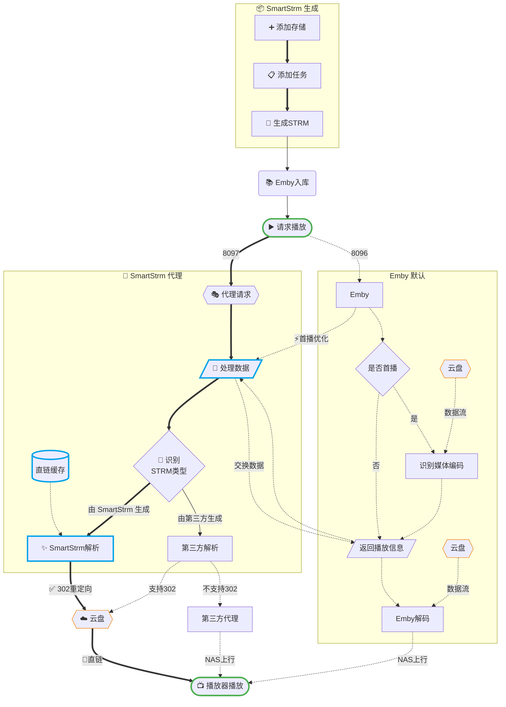

# 项目介绍

**SmartStrm** 是一款为私有媒体服务器打造的极效 **STRM 文件生成与管理系统**。

它旨在打通主流云盘（夸克、115、天翼等）与私有媒体库（Emby, Jellyfin, Plex, 飞牛影视）之间的“最后一公里”，实现网盘资源无感入库、丝滑秒开。


[快速部署 ->](/guide/deploy)

## 核心价值

1. **硬盘零压力**：将 TB 级别的蓝光资源映射为几 KB 的 `.strm` 文件，告别昂贵的硬盘扩容。
2. **入库不等待**：快速生成和入库，支持增量生成，新转存的电影、剧集直接加入你的媒体库中。
3. **播放不转圈**：依托 302 重定向技术，视频流直接由播放客户端向网盘请求，不经过你的 NAS 中转，避免带宽瓶颈。
4. **全自动闭环**：配合 `Quark-Auto-Save` `CloudSaver` 等工具，实现“转存->入库->播放”的全流程自动化。

## 什么是 STRM？

STRM 文件（`xxx.strm`）本质上是一个文本快捷方式。它告诉媒体服务器：“我并非二进制视频流，真正的视频流在下面这个 URL 里”。

**SmartStrm** 的任务就是：

- 替你找到这些资源的真实 URL
- 按照任务和规范的目录结构组织起来，自动生成
- 根据需要进行 302 劫持，让播放器获得最快的直链体验

::: details STRM 文件详情

> 以下意译自 [Emby 文档 - STRM 文件](https://emby.media/support/articles/Strm-Files.html)

通过 STRM 文件，你可以让 Emby 像播放本地文件一样，直接播放网络上的各种音视频流。只要 Emby 支持相应的格式和传输协议，就能正常播放。

简单来说，STRM 就是个普通的文本文件，只不过后缀名改成了 `.strm`，里面写上了网络流的链接（URL）。这同样适用于本地或局域网共享的媒体，此时文件里填的就是文件路径，而不是网址。

**使用方法**

先新建一个文本文档，把后缀名 `.txt` 改成 `.strm`。然后用记事本（或其他文本编辑器）打开它，把网络流的直链地址填进去；如果是本地或共享文件，就填文件路径。

内容格式如下：

```
http://host/path/stream
```

或

```
mms://host/path/stream
```

或

```
rtsp://host/path/stream
```

或本地路径：

```
F:/Movies/Topgun (1986)/Topgun.mp4
```

或网络共享路径：

```
\\EMBYSERVER\Movies\Topgun (1986)\Topgun.mp4
```

**举例说明**

电影目录结构：

```
\Movies
   \300 (2006)
      300 (2006).strm
```

STRM 文件适用于任何类型的视频，比如电影、剧集、音乐视频、家庭录像等。

命名方式和其他视频文件保持一致即可，然后放在同目录下就能被 Emby 识别。

:::

## 功能一览

- **存储管理**：轻松聚合媒体资源，多驱动灵活支持
- **任务管理**：灵活的 Cron 计划，支持增量/同步生成，便捷的字符串替换工具
- **存储浏览**：内置简单文件浏览器，支持 TMDB 智能识别批量重命名
- **插件管理**：提供文件名修复、内容替换、通知刷新等多种扩展能力
- **Webhook**：强大的“朋友圈”功能联动，转存触发任务，Emby 同步删除
- **302代理**：一站式 Emby/Jellyfin/Plex/飞牛影视 302 直链播放

## 工作原理

> [!TIP]
>
> 可能是**全网第一个**对 STRM 302 方案详细解释的原理图，**古法手打，人工校对，引用请保留出处**。
>
> *为便于识别和理解，部分细节仍有简化。*

