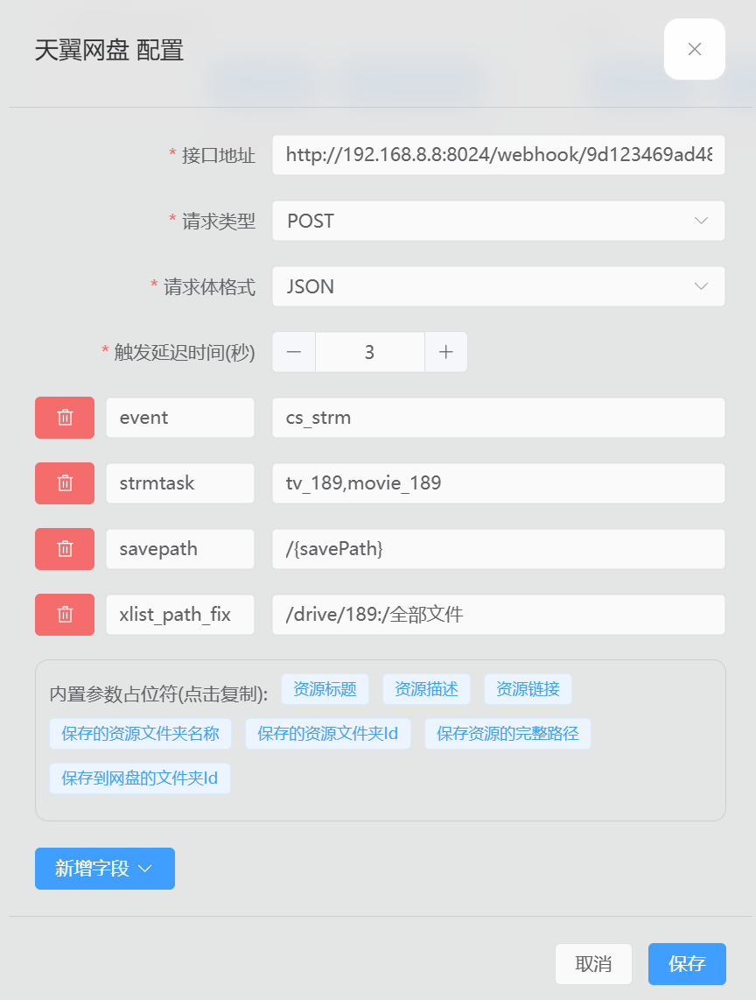
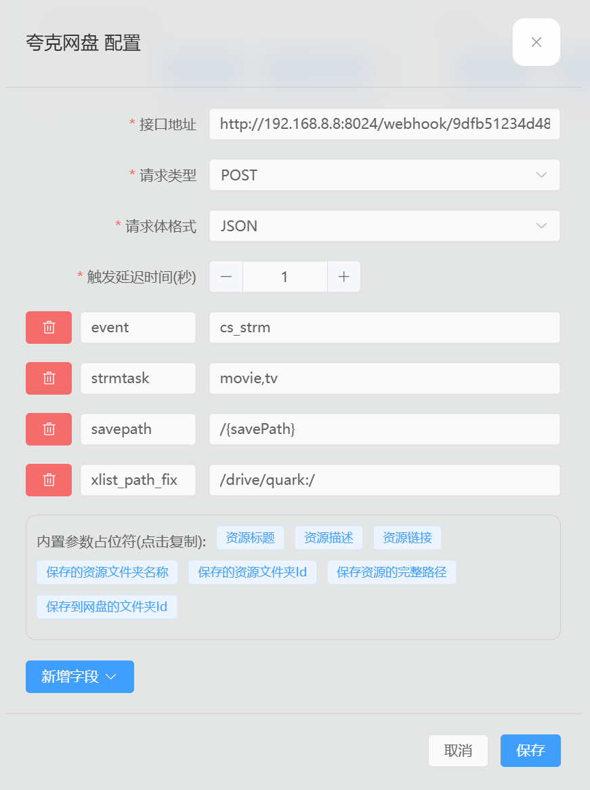

# Webhook

SmartStrm 强大的 Webhook 功能可以让你摆脱“定时扫描”的被动，实现“存即触发，秒级入库”，以及实现“Emby 删除同步”的闭环操作。

## 地址获取

在 **“系统设置**->**Webhook”** 中，你可以看到一个唯一的 URL，例如：

`http://yourip:8024/webhook/abcdef123456`

该链接含 token 信息，用于验证身份，请勿泄露；如不慎泄露，你可以点击右侧按钮进行 **重置**，重置后将使所有已在其他地方配置的 Webhook 失效。

## 常用联动方案

### Emby 删除同步

实现“在 Emby 中删除影片，同步删除网盘文件”的闭环操作。

> [!TIP] 实现前提
> SmartStrm 的 STRM 目录需挂载到 Emby 容器内的 `/strm` 路径。
>
> 如果你无法改变 Emby 的 STRM 目录（例如群晖套件版）的解决办法：手动修改 SmartStrm 的配置文件 `config.yaml` ，找到 `strm_in_emby:` ，修改为 SmartStrm 的 STRM 目录在 Emby 中的路径，重启 SmartStrm 。

在 **“系统设置->Webhook->Emby 删除同步设置”** 中启用该功能，默认关闭。

在 **“Emby->后台管理->通知”** 中设置：

- **网址**： SmartStrm Webhook 地址
- **请求内容类型**: application/json
- **Events**: 勾选 `媒体库-媒体删除`

### 联动 Quark-Auto-Save

QAS 在自动转存夸克资源后，可以通知 SmartStrm 立即生成 STRM。在 QAS 插件中设置：

- **webhook**: SmartStrm Webhook 地址
- **strmtask**: 关联的 SmartStrm 任务名，支持多个如 `tv,movie`
- **xlist_path_fix**: 可选
  - 如果 SS 使用的是夸克驱动，无需填写
  - 如果 SS 使用的是 OpenList 驱动挂载夸克，需填写路径映射。例如把夸克根目录 `/` 挂载在 OpenList 的 `/quark` 下，则填写 `/quark:/`
    - SmartStrm 会使 OpenList 强制刷新目录，无需再用 alist 插件刷新

### 联动 CloudSaver

支持夸克、天翼、115、123网盘在 CloudSaver 转存后触发生成 STRM，基本和 QAS 参数的逻辑相同，但需增加 `event` `savepath` 和调整 `xlist_path_fix` 参数。

- **webhook**: SmartStrm Webhook 地址，从 `系统设置 - Webhook` 中获取
- **strmtask**: 相关的 SmartStrm 任务名，支持多个如 `tv,movie`
- **event**: `cs_strm`
- **savepath**: `/{savePath}`
- **xlist_path_fix**: 可选
  - 任务使用夸克网盘、115 开放平台、123云盘开放平台、天翼云盘驱动时无须填写
  - 使用 OpenList 驱动时需填写，夸克、115、123网盘同 QAS，天翼云盘 `/你挂载在oplist的路径:/全部文件` ，只改动 : 前面部分，后面 /全部文件 保持不变。
- **delay**: `0` 可选，延迟执行的秒数

<details>
<summary>天翼网盘配置示例图</summary>



</details>

<details>
<summary>夸克网盘配置示例图</summary>



</details>

### 网页转存自动触发任务

在网页转存资源成功时，向 SmartStrm 推送当前的网盘类型和保存路径，自动匹配并触发任务。

**使用指引**：

1. 安装 [油猴/暴力猴/篡改猴](https://greasyfork.org/zh-CN/help/installing-user-scripts) 浏览器扩展
2. 安装脚本：[SmartStrm助手 - 转存触发任务](https://greasyfork.org/zh-CN/scripts/549634)
3. 打开任意分享页面，按提示填入 SmartStrm Webhook 地址
4. 如后续需要修改 Webhook 地址，可从油猴扩展菜单中呼出


### CloudDrive2 文件变更触发任务

在 **系统设置->Webhook->CloudDrive2 文件变更触发设置** 中启用功能，默认关闭。

并设置 **存储映射** ，有两种联动方式：

1. **两边各添加同一网盘的同一账号（推荐）**：支持 115、天翼云盘，填写格式为 `A=A1,B=B1,C=C1` 表示把 CD2 的 A 存储映射到 SS 的 A1 存储。

2. **利用 CD2 的 WebDAV 功能**：把 CD2 添加为 WebDAV 存储，该方式文件数据经过 CD2。
   1. 如添加 CD2 名为 `115open` 的存储到 SS 的 `115openA` ，WebDAV 地址 `http://yoururl:19798/dav/115open` ，映射填写格式同上如 `115open=115openA`。
   2. 也可以加整个 CD2 根目录，假如在 SS 名为 `CD2_DAV` 存储，填写格式为 `/=CD2_DAV`；但有以上指定存储映射时优先用指定的映射。

> [!TIP] 配置实例
>
> 使用 115 网盘，在 CD2 的名称是 `115open` ，在 SS 的名称是 `open115_Cp0204`
>
> 在 SS 中填写存储映射 `115open=open115_Cp0204` ，创建路径为 `/影视库/电影` 的任务
>
> 当 CD2 中检测到 `/115open/影视库/电影/影名 (2026)` 变更时，SS 会根据映射，自动找到要触发的任务。

CD2 中的配置，将以下内容复制到 CD2 的 Webhook 配置中，文件名自定义。

<details>
<summary>CloudDrive2 Webhook 配置</summary>

```ini
[global_params]
# 此处 base_url修改为你的 SmartStrm Webhook 地址，其他保持不变
base_url = "http://192.168.8.8:8024/webhook/9df1236ad884a83"
enabled = true

[global_params.default_headers]
content-type = "application/json"
user-agent = "clouddrive2/{version}"

[file_system_watcher]
url = "{base_url}/file_notify?device_name={device_name}&user_name={user_name}"
method = "POST"
enabled = true
body = '''
{
    "device_name": "{device_name}",
    "user_name": "{user_name}",
    "version": "{version}",
    "event_category": "{event_category}",
    "event_name": "{event_name}",
    "event_time": "{event_time}",
    "send_time": "{send_time}",
    "data": [
        {
            "action": "{action}",
            "is_dir": "{is_dir}",
            "source_file": "{source_file}",
            "destination_file": "{destination_file}"
        }
    ]
}
'''
```

</details>

### MoviePilot 整理完成触发任务

**使用场景**：影视资源和 MoviePilot 在远程大盘主机上，而 SS 、Emby 在本地轻主机上。

在 **系统设置->Webhook->MoviePilot 整理完成触发设置** 中启用功能，默认关闭。

并设置 **存储映射** ：如 `/media/movie=OPLIST/movie,/media/tv=OPLIST/tv` ，表示把 MP 的 `/media/movie` 路径映射到 SS 名为 `OPLIST` 的存储的 `/movie` 目录。

> [!TIP] 配置实例
>
> 在远程主机 MP 容器内电影路径是 `/media/movie` ，在 OpenList 中把该目录挂载到 `/movie`
>
> 在本地部署 SS ，添加该远程 OpenList 存储，名为 `OPLIST` ，并创建路径为 `/movie` 的任务
>
> 填写存储映射 `/media/movie=OPLIST/movie`
>
> 当 MP 整理完成 `/media/movie/影名 (2026)` 时，SS 会根据映射，自动找到要触发的任务。

在 MoviePilot 的 **插件->Webhook**（没有就在插件市场中搜，作者是 jxxghp 的）中设置：
- **请求方式**：POST
- **webhook地址**：SmartStrm Webhook 地址

## 开发者接口

SmartStrm 还支持通过自定义 POST 请求手动触发特定任务，供开发者调用：

```bash
curl --request POST \
  --url http://127.0.0.1:8024/webhook/9dfb51234d483e83 \
  --header 'Content-Type: application/json' \
  --data '{
    "event": "a_task",
    "delay": 0,
    "task": {
        "name": "test",
        "storage_path": "/drive/quark/test"
    },
    "strm": {
        "media_ext": [
            "mp4",
            "mkv"
        ],
        "url_encode": true,
        "media_size": 100,
        "copy_ext": [
            "srt",
            "ass"
        ]
    }
}'
```

| 参数                | 说明                                 |
| :------------------ | :----------------------------------- |
| `event`             | 固定为 `a_task`                      |
| `task.name`         | 已存在的任务名，仅支持单个           |
| `task.storage_path` | 可选，填写时必须为任务的路径或子路径 |
| `delay`             | 可选，延迟执行的秒数                 |
| `strm`              | 可选，STRM 设置字典                  |

最小化请求示例：

```bash
curl --request POST \
  --url http://127.0.0.1:8024/webhook/9dfb51234d483e83 \
  --header 'Content-Type: application/json' \
  --data '{
    "event": "a_task",
    "task": {
        "name": "movie_task"
    }
}'
```